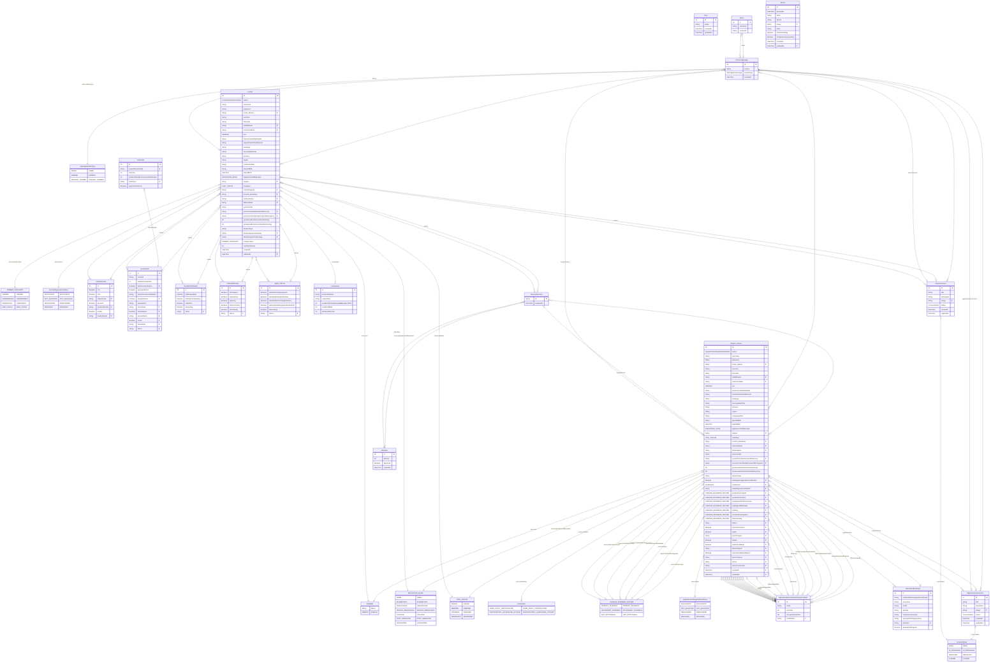

```mermaid
erDiagram

        GENDER {
            MALE MALE
FEMALE FEMALE
        }
    


        EDUCATION_LEVEL {
            NONE NONE
ELEMENTARY ELEMENTARY
HIGHSCHOOL HIGHSCHOOL
SENIOR_HIGHSCHOOL SENIOR_HIGHSCHOOL
COLLEGE COLLEGE
POST_GRADUATE POST_GRADUATE
VOCATIONAL VOCATIONAL
        }
    


        CIVIL_STATUS {
            SINGLE SINGLE
MARRIED MARRIED
WIDOWED WIDOWED
SEPARATED SEPARATED
        }
    


        FARMER_CATEGORY {
            FARMER FARMER
FARMWORKER FARMWORKER
FISHERFOLK FISHERFOLK
AGRI_YOUTH AGRI_YOUTH
        }
    


        Certification {
            THIRD_PARTY_CERTIFICATION THIRD_PARTY_CERTIFICATION
PARTICIPATORY_GUARANTEE_SYSTEM PARTICIPATORY_GUARANTEE_SYSTEM
        }
    


        CHOICES_BUSINESS_NATURE {
            PRIMARY_BUSINESS PRIMARY_BUSINESS
SECONDARY_BUSINESS SECONDARY_BUSINESS
NOT_APPLICABLE NOT_APPLICABLE
        }
    


        organicFarmerRegistrationsStatus {
            APPLICANTS APPLICANTS
NOT_QUALIFIED NOT_QUALIFIED
REGISTERED REGISTERED
ARCHIVED ARCHIVED
        }
    


        FarmerRegistrationsStatus {
            APPLICANTS APPLICANTS
NOT_QUALIFIED NOT_QUALIFIED
REGISTERED REGISTERED
ARCHIVED ARCHIVED
        }
    


        ConcernStatus {
            OPEN OPEN
IN_PROGRESS IN_PROGRESS
RESOLVED RESOLVED
CLOSED CLOSED
        }
    


        MessageSenderType {
            ADMIN ADMIN
FARMER FARMER
ORGANIC_FARMER ORGANIC_FARMER
        }
    
  "Post" {
    Int id "🗝️"
    String name 
    DateTime createdAt 
    DateTime updatedAt 
    }
  

  "Admin" {
    Int id "🗝️"
    String username 
    String password 
    }
  

  "Farmer" {
    Int id "🗝️"
    FarmerRegistrationsStatus status 
    String username 
    String password 
    String email_address "❓"
    String surname 
    String firstname 
    String middleName "❓"
    String extensionName "❓"
    GENDER sex 
    String houseOrLotOrBuildingNo 
    String streetOrSitioOrSubDivision 
    String barangay 
    String municipalityOrCity 
    String province 
    String region 
    String contactNumber 
    String placeOfBirth 
    DateTime dateOfBirth 
    EDUCATION_LEVEL highestFormOfEducation 
    String religion "❓"
    CIVIL_STATUS civilStaus 
    String nameOfSpouse "❓"
    String FourPS_Benificiaty "❓"
    String mothersName "❓"
    String fathersName "❓"
    String govermentId 
    String personToContactIncaseOfEmerceny "❓"
    String personContactNumberIncaseOfEmergency "❓"
    Int grossAnualIncomeLastYearFarming 
    Int grossAnualIncomeLastYeaNonFarming 
    String farmerImage 
    String farmerSignatureAsImage "❓"
    String farmerFingerPrintAsImage "❓"
    FARMER_CATEGORY categoryType 
    Int numberOfFarms 
    DateTime createdAt 
    DateTime updatedAt "❓"
    }
  

  "FarmerDetails" {
    Int id "🗝️"
    Boolean rice 
    Boolean corn 
    String othersCrops "❓"
    Boolean livestock 
    String livestockDetails "❓"
    Boolean poultry 
    String poultryDetails "❓"
    }
  

  "LotDetails" {
    Int id "🗝️"
    String cropsORCommodity "❓"
    Int sizeInHa 
    Int numberOfHeadForLivestockAndPoultry 
    String FarmType "❓"
    Boolean organicPractitioner 
    }
  

  "FarmDetails" {
    Int id "🗝️"
    String Location 
    Int TotalFarmAreaInHa 
    Boolean withAncestordomain "❓"
    Boolean agrarianReform 
    String OwnerDocumentsNumber 
    Boolean RegisterOwner "❓"
    String ownerName 
    String othersField "❓"
    Boolean tenantOwner "❓"
    String teenantName "❓"
    Boolean Leese "❓"
    String leeseName "❓"
    String others "❓"
    }
  

  "FarmWorkerDetails" {
    Int id "🗝️"
    Boolean landPreparation 
    Boolean plantingTransplanting 
    Boolean cultivation 
    Boolean harvesting 
    String others "❓"
    }
  

  "FisherfolkDetails" {
    Int id "🗝️"
    Boolean fishCapture 
    Boolean aquaculture 
    Boolean gleaning 
    Boolean fishProcessing 
    Boolean fishVending 
    String others "❓"
    }
  

  "AGRI_YOUTH" {
    Int id "🗝️"
    Boolean partOfFarmingHouseHold 
    Boolean attendedFormalAgriFishery 
    Boolean attendedNonFormalAgriFishery 
    Boolean participatedInAnyAgriculturalActivity 
    Boolean fishVending 
    String others "❓"
    }
  

  "houseHead" {
    Int id "🗝️"
    String houseHoldHead 
    String relationship 
    Int numberOfLivingHouseHoldMembersTotal 
    Int numberOfMale 
    Int NumberOfFemale 
    }
  

  "FarmerConcern" {
    Int id "🗝️"
    String title 
    String description 
    String image "❓"
    ConcernStatus status 
    DateTime createdAt 
    DateTime updatedAt 
    }
  

  "Organic_Farmer" {
    Int id "🗝️"
    organicFarmerRegistrationsStatus status 
    String username 
    String password 
    String email_address "❓"
    String surname 
    String firstname 
    String middleName "❓"
    String extensionName "❓"
    GENDER sex 
    String houseOrLotOrBuildingNo 
    String streetOrSitioOrSubDivision 
    String barangay 
    String municipalityOrCity 
    String province 
    String region 
    String contactNumber 
    String placeOfBirth 
    DateTime dateOfBirth 
    EDUCATION_LEVEL highestFormOfEducation 
    String religion "❓"
    CIVIL_STATUS civilStaus 
    String FourPS_Benificiaty "❓"
    String mothersName "❓"
    String fathersName "❓"
    String govermentId 
    String personToContactIncaseOfEmerceny "❓"
    String personContactNumberIncaseOfEmergency "❓"
    Int grossAnualIncomeLastYearFarming 
    Int grossAnualIncomeLastYeaNonFarming 
    String farmerImage 
    Boolean withOrganicAgricultureCertification "❓"
    Certification certification "❓"
    String whatStagesInCertification "❓"
    CHOICES_BUSINESS_NATURE productionForInputs "❓"
    CHOICES_BUSINESS_NATURE productionForFood "❓"
    CHOICES_BUSINESS_NATURE postHarvestAndProcessing "❓"
    CHOICES_BUSINESS_NATURE tradingAndWholeSale "❓"
    CHOICES_BUSINESS_NATURE retailing "❓"
    CHOICES_BUSINESS_NATURE transPortAndLogistics "❓"
    CHOICES_BUSINESS_NATURE WareHousing "❓"
    String Others "❓"
    Boolean direcToConsumer "❓"
    Boolean trader "❓"
    String specificType1 "❓"
    Boolean retailer "❓"
    Boolean institutionalBuyer "❓"
    String SpecificType2 "❓"
    Boolean internationalBasedBuyers "❓"
    String SpecificType3 "❓"
    String others "❓"
    String othersCommodity "❓"
    DateTime createdAt "❓"
    DateTime updatedAt "❓"
    }
  

  "AgriculturalCommoditiesFisheryProducts" {
    Int id "🗝️"
    String name 
    Int sizeInHa 
    Int annualVolumeInKG 
    String Certification "❓"
    }
  

  "OwnSharedFacilities" {
    Int id "🗝️"
    String facilitiesMachineryEquipmentUsed 
    String ownership 
    String model 
    String quantity 
    String volumeServicesArea 
    String averageWorkingHoursDay 
    String Remarks "❓"
    Boolean dedicatedToOrganic 
    }
  

  "OrganicFarmerConcern" {
    Int id "🗝️"
    String title 
    String description 
    String image "❓"
    ConcernStatus status 
    DateTime createdAt 
    DateTime updatedAt 
    }
  

  "ConcernMessage" {
    Int id "🗝️"
    String content 
    MessageSenderType senderType 
    DateTime createdAt 
    }
  

  "Allocation" {
    Int id "🗝️"
    Int amount 
    Boolean approved 
    DateTime createdAt 
    }
  

  "FarmerAllocation" {
    String id "🗝️"
    DateTime assignedAt 
    }
  

  "Events" {
    Int id "🗝️"
    DateTime Eventdate 
    String What 
    String Where 
    String Image "❓"
    String Note 
    Boolean forFarmersOnly 
    Boolean forOgranicsFarmersOnly 
    DateTime createdAt 
    DateTime updatedAt "❓"
    }
  
    "Admin" o{--}o "ConcernMessage" : ""
    "Farmer" o|--|| "FarmerRegistrationsStatus" : "enum:status"
    "Farmer" o|--|| "GENDER" : "enum:sex"
    "Farmer" o|--|| "EDUCATION_LEVEL" : "enum:highestFormOfEducation"
    "Farmer" o|--|| "CIVIL_STATUS" : "enum:civilStaus"
    "Farmer" o|--|| "FARMER_CATEGORY" : "enum:categoryType"
    "Farmer" o{--}o "FarmerDetails" : ""
    "Farmer" o{--}o "FarmWorkerDetails" : ""
    "Farmer" o{--}o "FisherfolkDetails" : ""
    "Farmer" o{--}o "AGRI_YOUTH" : ""
    "Farmer" o|--|o "houseHead" : "houseHead"
    "Farmer" o{--}o "FarmDetails" : ""
    "Farmer" o{--}o "FarmerConcern" : ""
    "Farmer" o{--}o "ConcernMessage" : ""
    "Farmer" o{--}o "FarmerAllocation" : ""
    "FarmerDetails" o|--|| "Farmer" : "farmer"
    "LotDetails" o|--|| "FarmDetails" : "farmerDetails"
    "FarmDetails" o|--|| "Farmer" : "farmer"
    "FarmWorkerDetails" o|--|| "Farmer" : "farmer"
    "FisherfolkDetails" o|--|| "Farmer" : "farmer"
    "AGRI_YOUTH" o|--|| "Farmer" : "farmer"
    "FarmerConcern" o|--|| "ConcernStatus" : "enum:status"
    "FarmerConcern" o|--|| "Farmer" : "farmer"
    "FarmerConcern" o{--}o "ConcernMessage" : ""
    "Organic_Farmer" o|--|| "organicFarmerRegistrationsStatus" : "enum:status"
    "Organic_Farmer" o|--|| "GENDER" : "enum:sex"
    "Organic_Farmer" o|--|| "EDUCATION_LEVEL" : "enum:highestFormOfEducation"
    "Organic_Farmer" o|--|| "CIVIL_STATUS" : "enum:civilStaus"
    "Organic_Farmer" o|--|o "Certification" : "enum:certification"
    "Organic_Farmer" o|--|o "CHOICES_BUSINESS_NATURE" : "enum:productionForInputs"
    "Organic_Farmer" o|--|o "CHOICES_BUSINESS_NATURE" : "enum:productionForFood"
    "Organic_Farmer" o|--|o "CHOICES_BUSINESS_NATURE" : "enum:postHarvestAndProcessing"
    "Organic_Farmer" o|--|o "CHOICES_BUSINESS_NATURE" : "enum:tradingAndWholeSale"
    "Organic_Farmer" o|--|o "CHOICES_BUSINESS_NATURE" : "enum:retailing"
    "Organic_Farmer" o|--|o "CHOICES_BUSINESS_NATURE" : "enum:transPortAndLogistics"
    "Organic_Farmer" o|--|o "CHOICES_BUSINESS_NATURE" : "enum:WareHousing"
    "Organic_Farmer" o{--}o "AgriculturalCommoditiesFisheryProducts" : ""
    "Organic_Farmer" o{--}o "AgriculturalCommoditiesFisheryProducts" : ""
    "Organic_Farmer" o{--}o "AgriculturalCommoditiesFisheryProducts" : ""
    "Organic_Farmer" o{--}o "AgriculturalCommoditiesFisheryProducts" : ""
    "Organic_Farmer" o{--}o "AgriculturalCommoditiesFisheryProducts" : ""
    "Organic_Farmer" o{--}o "AgriculturalCommoditiesFisheryProducts" : ""
    "Organic_Farmer" o{--}o "AgriculturalCommoditiesFisheryProducts" : ""
    "Organic_Farmer" o{--}o "AgriculturalCommoditiesFisheryProducts" : ""
    "Organic_Farmer" o{--}o "AgriculturalCommoditiesFisheryProducts" : ""
    "Organic_Farmer" o{--}o "AgriculturalCommoditiesFisheryProducts" : ""
    "Organic_Farmer" o{--}o "AgriculturalCommoditiesFisheryProducts" : ""
    "Organic_Farmer" o{--}o "AgriculturalCommoditiesFisheryProducts" : ""
    "Organic_Farmer" o{--}o "OwnSharedFacilities" : ""
    "Organic_Farmer" o{--}o "OrganicFarmerConcern" : ""
    "Organic_Farmer" o{--}o "ConcernMessage" : ""
    "Organic_Farmer" o{--}o "FarmerAllocation" : ""
    "AgriculturalCommoditiesFisheryProducts" o|--|o "Organic_Farmer" : "Grains"
    "AgriculturalCommoditiesFisheryProducts" o|--|o "Organic_Farmer" : "LowlandVegetables"
    "AgriculturalCommoditiesFisheryProducts" o|--|o "Organic_Farmer" : "UplandVegetables"
    "AgriculturalCommoditiesFisheryProducts" o|--|o "Organic_Farmer" : "FruitsAndNots"
    "AgriculturalCommoditiesFisheryProducts" o|--|o "Organic_Farmer" : "Mushroom"
    "AgriculturalCommoditiesFisheryProducts" o|--|o "Organic_Farmer" : "OrganicSoil"
    "AgriculturalCommoditiesFisheryProducts" o|--|o "Organic_Farmer" : "Rootcrops"
    "AgriculturalCommoditiesFisheryProducts" o|--|o "Organic_Farmer" : "PultryProducts"
    "AgriculturalCommoditiesFisheryProducts" o|--|o "Organic_Farmer" : "LiveStockProducts"
    "AgriculturalCommoditiesFisheryProducts" o|--|o "Organic_Farmer" : "FisheriesAndAquaCulture"
    "AgriculturalCommoditiesFisheryProducts" o|--|o "Organic_Farmer" : "IndustrialCropsAndProducts"
    "AgriculturalCommoditiesFisheryProducts" o|--|o "Organic_Farmer" : "OtherCommodity"
    "OwnSharedFacilities" o|--|o "Organic_Farmer" : "organicFarmer"
    "OrganicFarmerConcern" o|--|| "ConcernStatus" : "enum:status"
    "OrganicFarmerConcern" o|--|| "Organic_Farmer" : "organicFarmer"
    "OrganicFarmerConcern" o{--}o "ConcernMessage" : ""
    "ConcernMessage" o|--|| "MessageSenderType" : "enum:senderType"
    "ConcernMessage" o|--|o "Admin" : "admin"
    "ConcernMessage" o|--|o "Farmer" : "farmer"
    "ConcernMessage" o|--|o "Organic_Farmer" : "organicFarmer"
    "ConcernMessage" o|--|o "FarmerConcern" : "farmerConcern"
    "ConcernMessage" o|--|o "OrganicFarmerConcern" : "organicFarmerConcern"
    "Allocation" o{--}o "FarmerAllocation" : ""
    "FarmerAllocation" o|--|o "Farmer" : "farmer"
    "FarmerAllocation" o|--|o "Organic_Farmer" : "organicFarmer"
    "FarmerAllocation" o|--|| "Allocation" : "allocation"
```
